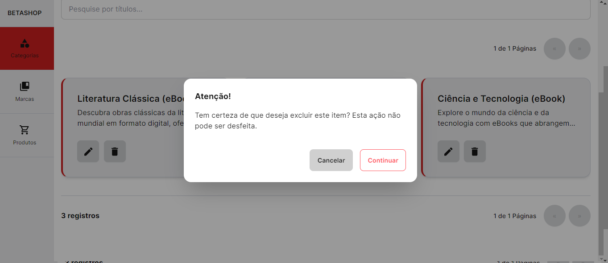

# Frontend

Bem-vindo ao Beta Shop.

## Tecnologias Utilizadas

Este projeto foi desenvolvido utilizando:

- Next.js na versão 14
- TypeScript
- Tailwind CSS.
- Foi implementando um modo escuro na área administrava.

_Não foi utilizado nenhum template como base para a criação do projeto._

## Instalação

Siga os passos abaixo para configurar o ambiente de desenvolvimento e executar o projeto.

### Pré-requisitos

Certifique-se de ter o **Node.js** na versão 18 ou superior instalado. Você pode baixar a versão mais recente [aqui](https://nodejs.org/en).

## Passos para executar o projeto

### 1. Clone o repositório

```
git clone https://github.com/pedrohygorveras/Desafio.git
```

### 2. Configure o arquivo .env

Copie o arquivo .env.example e renomeie a cópia para ".env", em seguida, faça os ajustes necessários nos dados conforme suas configurações específicas.

### 3. Instale as dependências do projeto:

```
npm install
```

### 4. Inicie a aplicação:

```
npm run dev
```

Agora, a aplicação estará disponível em http://localhost:3000 no seu navegador.

## Sobre o projeto:

Foi implementado o CRUD completo (criar, ler, editar, excluir) em todas as áreas

### Cadastro


### Edição


### Listagem com filtros de busca e páginação


### Remoção de items com confirmação



### O Cadastro de produtos permite cadastrar 1 marca é múltiplas categorias (foi feito uma validação em nível de backend é frontend para não repetir categorias no mesmo produto)


### A listagem de produtos também conta com um campo de busca para uma marca específica.


### Ambiente darkmode


### Página inicial com filtro de categorias além de um sistema que permite adicionar ou remover do carrinho de compras


### Página de login

(não foi implementando o sistema de login, está parte e apenas visual)


